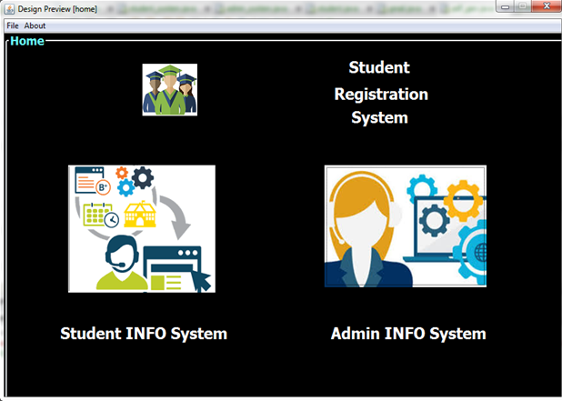
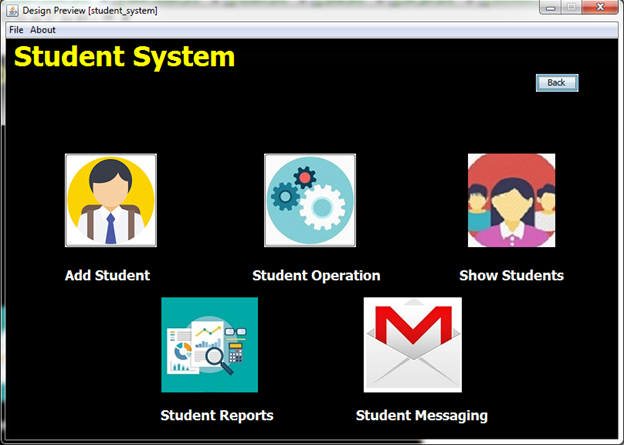
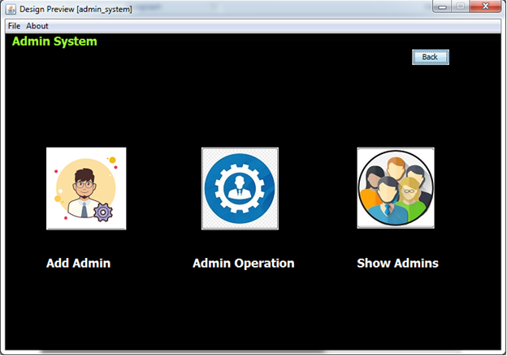
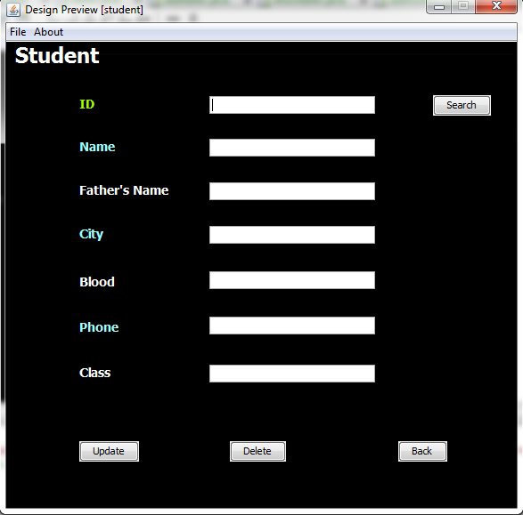

# student_registration_system
Java mini project for SE OOPM. An student registration system which simplifies tasks for admin with features like sending mail, generating progress report, maintaining student data all at one place with some easy steps.

